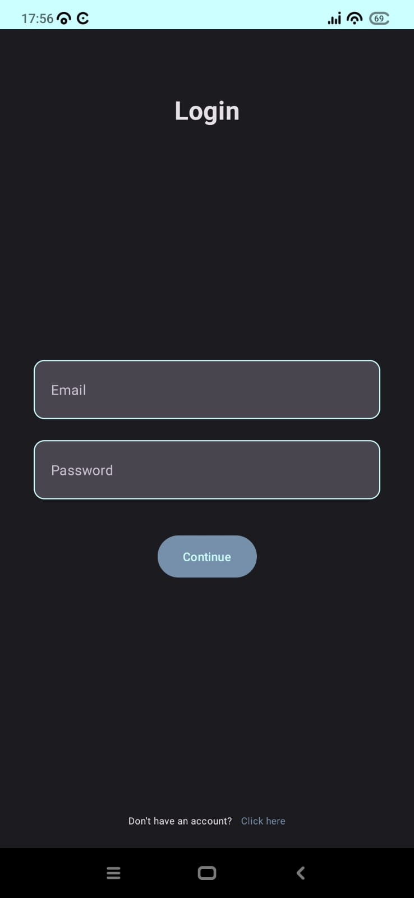
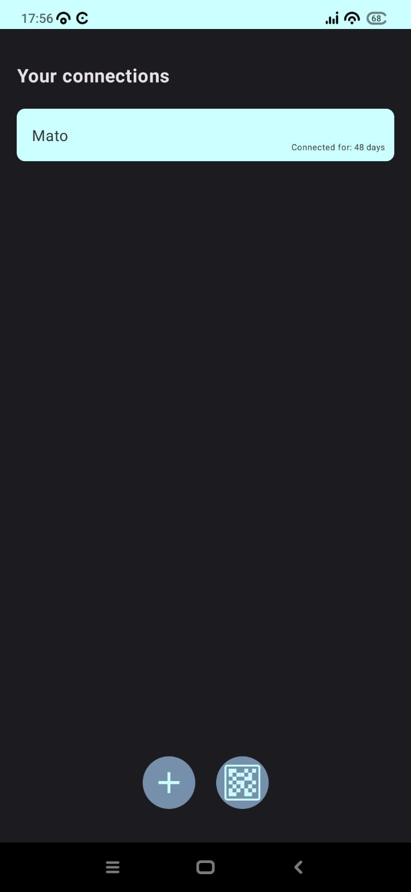
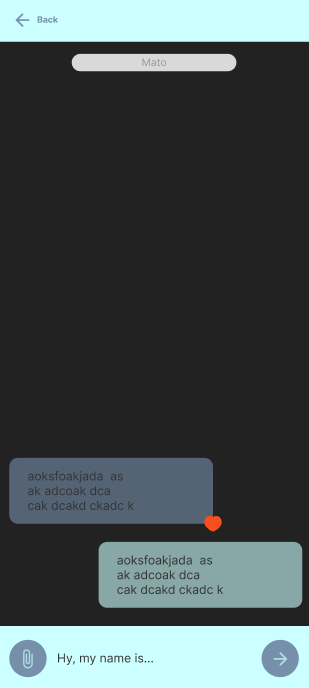

# ChatAppTest
Testing functionalities of GhostThread with Appium and TestNG.

## **Description**
GhostThread is a chat app like Whatsapp or Viber. Currently, the app has only main functionalities like sending, receiving and liking messages.
Another main feature of the app is the connecting via the QR code. Every user has a unique QR code created from their username (email) that can be scanned with the builtin QR code reader, that when a scan is successful it adds a connection of the 2 users to the database.
In the near future it will be enabled when both users exit a chat the whole conversation history is deleted.

   

This project is created to test the functionalities listed above this paragraph. This project contains 4 tests:

Login Test that fails - testing login functionality

Login Test that succeeds - testing login functionality

Register Test that fails - testing the creation of an existing user

App Test - testing the navigation and functionalities of the app (there is only one so the database isn't spammed with login requests)

## **Getting Started**

Ask the GhostThread owner for access to the repository and passwords.

Start a Deamon background process, start the emulator, install the app to the emulator and start the server from the command prompt.
Start the Appium app, start server.
Start the tests by typing this "mvn test (ctrl + enter)" in the terminal of the test SDK 

### **Dependencies**

Following dependencies are required for this project to work properly:

appium 7.3.0

testng 7.0.0

maven-surefire-report-plugin 2.22.1

maven-compiler-plugin 3.8.1

### **Project requirements**

In order to properly run this project, it is necessary to install GhostThread to the desired device.

To run appium code it is necessary to install Node.js.

Also, there needs to be an emulator running or a device connected to the computer.

### **Author**

Leo Svjetličić